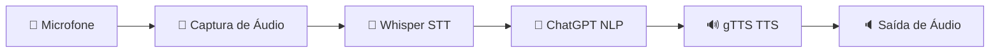

# 🤖 Assistente de Voz Ana - Agente de Conversa

Este projeto é um assistente virtual inteligente e proativo que permite a interação por voz utilizando as tecnologias mais avançadas da OpenAI. Ele foi desenvolvido como parte do desafio da DIO (Digital Innovation One) para criar um agente conversacional robusto e funcional.

## 🏗️ Arquitetura do Sistema

O fluxo de processamento segue uma arquitetura simples, porém escalável:



1.  **Captura**: O áudio é gravado do microfone em formato `.wav`.
2.  **Transcrição (STT)**: O modelo **Whisper** da OpenAI converte o áudio em texto com alta precisão.
3.  **Processamento (NLP)**: O **ChatGPT (GPT-4o)** processa o texto, mantém o contexto da conversa e gera uma resposta inteligente.
4.  **Síntese (TTS)**: O **gTTS** (Google Text-to-Speech) converte a resposta textual em áudio.
5.  **Execução**: O áudio resultante é reproduzido para o usuário.

---

## ✨ Diferenciais e Funcionalidades

Diferente de protótipos básicos, este projeto implementa características profissionais:

-   **🔄 Modo Alexa (Loop Contínuo)**: O assistente fica em "standby" escutando continuamente.
-   **🔑 Wake Word Detection**: Ativação automática ao detectar a palavra-chave **"Ana"**.
-   **🧠 Memória de Contexto**: Mantém o histórico da conversa para respostas mais coerentes.
-   **⚙️ Configurável via `.env`**: Todas as chaves, nomes e durações podem ser ajustados facilmente.
-   **🧹 Gestão Automática de Temporários**: Limpeza de arquivos de áudio após o uso para economizar espaço.

---

## 🚀 Instalação e Configuração

### 1. Pré-requisitos
Certifique-se de ter o Python 3.11 ou superior instalado.

### 2. Configurar o Ambiente
```powershell
# Criação do ambiente virtual
python -m venv .venv

# Ativação (Windows)
.\.venv\Scripts\Activate.ps1

# Instalação das dependências
pip install -r requirements.txt
```

### 3. Variáveis de Ambiente
Crie um arquivo `.env` na raiz do projeto (use o `.env.example` como base):
```powershell
copy .env.example .env
```
Edite o arquivo `.env` e adicione sua chave:
`OPENAI_API_KEY=sua_chave_aqui`

---

## 🎮 Como Usar

### Modo Padrão (Interativo/Alexa)
```powershell
python main.py
```
Neste modo, basta dizer **"Ana"** e aguardar o sinal sonoro para falar seu comando.

### Modo Comando Único
```powershell
python main.py --single
```
Útil para testes rápidos ou integrações específicas.

---

## 🛠️ Tecnologias Utilizadas

-   **Python**: Linguagem core do projeto.
-   **OpenAI API**: Whisper (Transcrição) e GPT-4o (Inteligência).
-   **sounddevice & scipy**: Captura e processamento de sinais de áudio.
-   **gTTS**: Síntese de voz natural.
-   **playsound**: Reprodução de áudio multiplataforma.
-   **python-dotenv**: Gestão segura de credenciais.

---

## 📝 Comandos Especiais (Voz)
-   *"Sair" / "Desligar"*: Encerra o assistente.
-   *"Resetar" / "Limpar Histórico"*: Apaga a memória da conversa atual.
